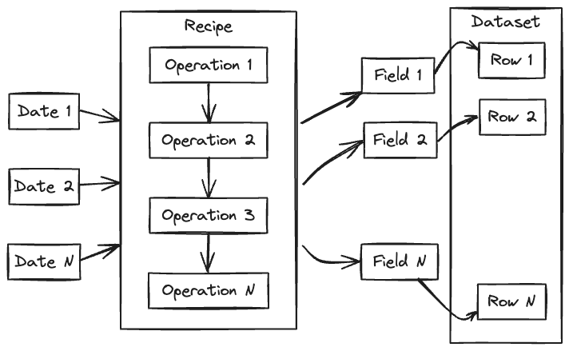

.. _building-introduction:

##############
 Introduction
##############

The `anemoi-datasets` package allows you to create datasets for training
data-driven weather models. The datasets are built using a `recipe`
file, which is a YAML file that describes sources of meteorological
fields as well as the operations to perform on them, before they are
written to a zarr file. The input of the process is a range of dates and
some options to control the layout of the output. Statistics will be
computed as the dataset is build, and stored in the metadata, with other
information such as the the locations of the grid points, the list of
variables, etc.

**********
 Concepts
**********

date
   Throughout this document, the term `date` refers to a date and time,
   not just a date. A training dataset is covers a continuous range of
   dates with a given frequency. Missing dates are still part of the
   dataset, but the data are missing and marked as such using NaNs.
   Dates are always in UTC, and refer to date at which the data is
   valid. For accumulations and fluxes, that would be the end of the
   accumulation period.

variable
   A `variable` is meteorological parameter, such as temperature, wind,
   etc. Multilevel parameters are treated as separate variables, one for
   each level. For example, temperature at 850 hPa and temperature at
   500 hPa will be treated as two separate variables (`t_850` and
   `t_500`).

field
   A `field` is a variable at a given date. It is represented by a array
   of values at each grid point.

source
   The `source` is a software component that given a list of dates and
   variables will return the corresponding fields. A example of source
   is ECMWF's MARS archive, a collection of GRIB or NetCDF files, a
   database, etc. See :ref:`sources` for more information.

filter
   A `filter` is a software component that takes as input the output of
   a source or the output of another filter can modify the fields and/or
   their metadata. For example, typical filters are interpolations,
   renaming of variables, etc. See :ref:`filters` for more information.

************
 Operations
************

In order to build a training dataset, sources and filters are combined
using the following operations:

join
   The join is the process of combining several sources data. Each
   source is expected to provide different variables at the same dates.

pipe
   The pipe is the process of transforming fields using filters. The
   first step of a pipe is typically a source, a join or another pipe.
   The following steps are filters.

concat
   The concatenation is the process of combining different sets of
   operation that handle different dates. This is typically used to
   build a dataset that spans several years, when the several sources
   are involved, each providing a different period.

Each operation is considered as a :ref:`source <sources>`, therefore
operations can be combined to build complex datasets.

*****************
 Getting started
*****************

First recipe
============

The simplest `recipe` file must contain a ``dates`` section and an
``input`` section. The latter must contain a `source` In that case, the
source is ``mars``

.. literalinclude:: yaml/building1.yaml
   :language: yaml

To create the dataset, run the following command:

.. code:: console

   $ anemoi-datasets create recipe.yaml dataset.zarr

Once the build is complete, you can inspect the dataset using the
following command:

.. code:: console

   $ anemoi-datasets inspect dataset.zarr

.. literalinclude:: yaml/building1.txt
   :language: console

Adding a second source
======================

To add a second source, you need to use the ``join`` operation. In that
example, we add pressure level variables to the previous example:

.. literalinclude:: yaml/building2.yaml
   :language: yaml

This will build the following dataset:

.. literalinclude:: yaml/building2.txt
   :language: console

.. note::

   Please note that the pressure levels parameters are named
   `param_level`. This is the default behaviour. See
   :ref:`remapping_option` for more information.

Adding some forcing variables
=============================

When training a data-driven models, some forcing variables may be
required such as the solar radiation, the time of day, the day in the
year, etc.

These are provided by the ``forcings`` source. In that example, we add a
few of them. The `template` option is used to point to another source,
in that case the first instance of ``mars``. This source is used to get
information about the grid points, as some of the forcing variables are
grid dependent.

.. literalinclude:: yaml/building3.yaml
   :language: yaml

This will build the following dataset:

.. literalinclude:: yaml/building3.txt
   :language: console

See :ref:`forcing_variables` for more information about forcing
variables.
