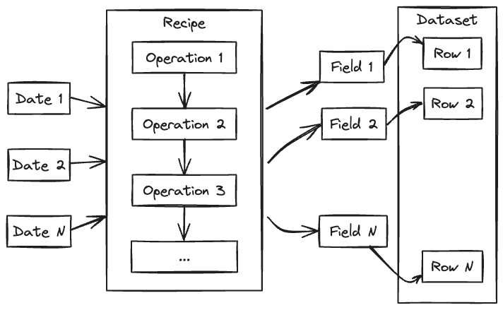

.. _building-introduction:

############################
 Building your own datasets
############################

The `anemoi-datasets` package allows you to create datasets for training
data-driven weather models. The datasets are built using a `recipe`
file, which is a YAML file that describes sources of meteorological
fields as well as the operations to perform on them, before they are
written to a zarr file. The input of the process is a range of dates and
some options to control the layout of the output. Statistics will be
computed as the dataset is built, and stored in the metadata, with other
information such as the locations of the grid points, the list of
variables, etc.

**********
 Concepts
**********

date
   Throughout this document, the term `date` refers to a date and time,
   not just a date. A training dataset covers a continuous range of
   dates with a given frequency. Missing dates are still part of the
   dataset, but missing data are marked as such using NaNs. Dates are
   always in UTC, and refer to the date at which the data is valid. For
   accumulations and fluxes, that would be the end of the accumulation
   period.

variable
   A `variable` is a meteorological parameter, such as temperature,
   wind, etc. Multilevel parameters are treated as separate variables,
   one for each level. For example, temperature at 850 hPa and
   temperature at 500 hPa will be treated as two separate variables
   (`t_850` and `t_500`).

field
   A `field` is a variable at a given date. It is represented by an
   array of values at each grid point.

source
   The `source` is a software component that, given a list of dates and
   variables, will return the corresponding fields. An example of a
   source is ECMWF's MARS archive, a collection of GRIB or NetCDF files,
   a database, etc. See :ref:`sources` for more information.

filter
   A `filter` is a software component that takes as input the output of
   a source or another filter and can modify the fields and/or their
   metadata. For example, typical filters are interpolations, renaming
   of variables, etc. See :ref:`filters` for more information.

************
 Operations
************

In order to build a training dataset, sources and filters are combined
using the following operations:

join
   The join is the process of combining several sources of data. Each
   source is expected to provide different variables for the same of
   dates.

pipe
   The pipe is the process of transforming fields using filters. The
   first step of a pipe is typically a source, a join, or another pipe.
   This can subsequently be followed by more filters.

concat
   The concatenation is the process of combining different sets of
   operations that handle different dates. This is typically used to
   build a dataset that spans several years, when several sources are
   involved, each providing data for a different period.

Each operation is considered as a :ref:`source <sources>`, therefore
operations can be combined to build complex datasets.

.. toctree::
   :maxdepth: 1
   :hidden:
   :caption: Building datasets

   operations
   sources
   filters
   naming-variables
   handling-missing-dates
   handling-missing-values
   statistics
   incremental
   advanced-options

********************
 Naming Conventions
********************

.. toctree::
   :maxdepth: 1
   :hidden:
   :caption: Naming Conventions

   naming-conventions
