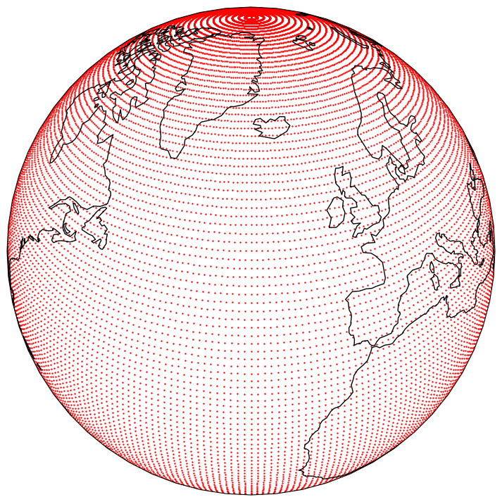
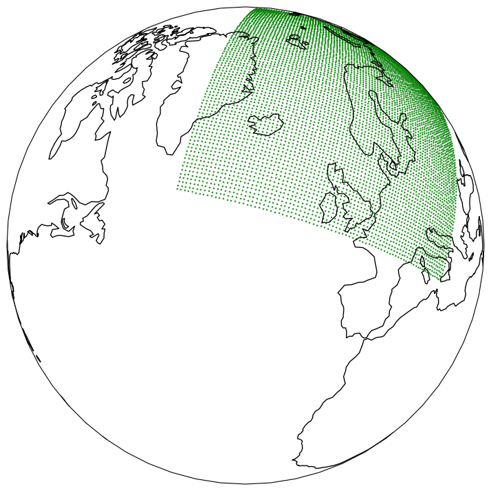
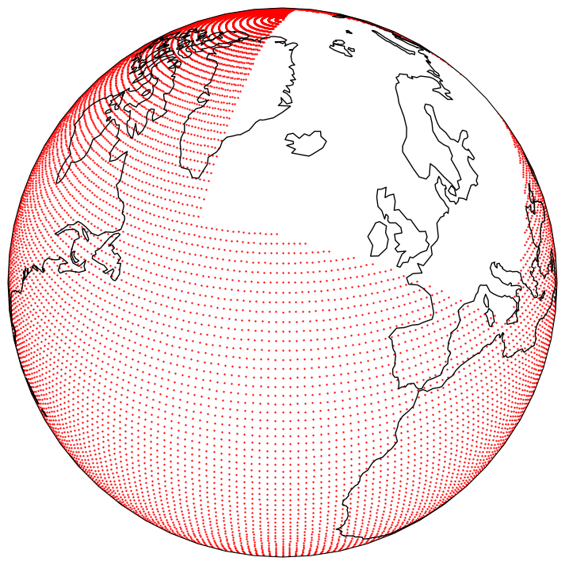
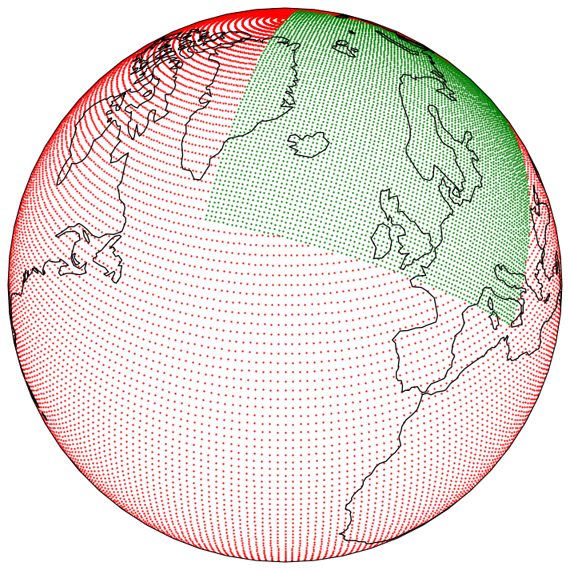
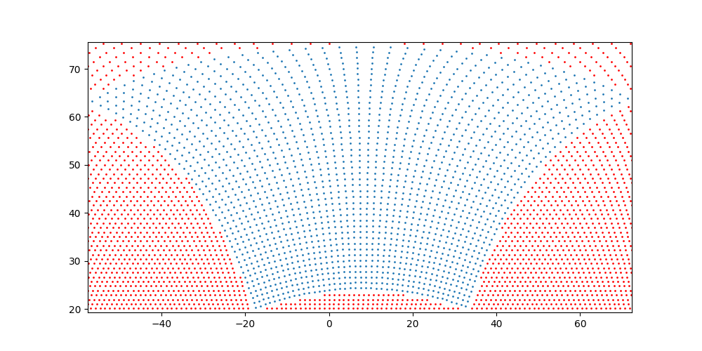
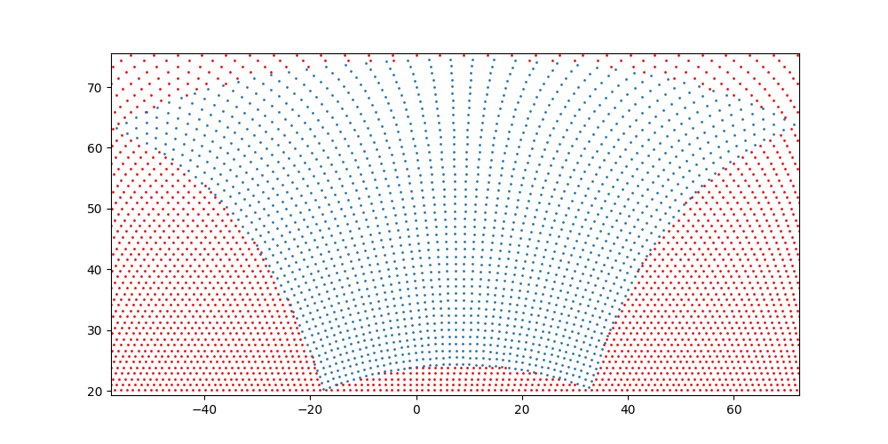

.. _combining-datasets:

####################
 Combining datasets
####################

You can create "virtual" datasets by combining two or more datasets. The
combination will behave exactly as if you had a single dataset, with all
the methods behaving as expected. The package will ensure that the data
is loaded lazily from the original datasets.

.. warning::

   When combining datasets, the statistics of the first dataset are used
   by default. You can change this by setting the
   :ref:`selecting-statistics` option to a different dataset, even if it
   is not part of the combination.

When combining datasets, the package will check that the datasets are
compatible, i.e., that they have the same resolution, the same
variables, etc. The compatibility checks depend on the type of
combination. You can adjust some of the attributes of the datasets to
make them compatible, e.g., by changing their date range or frequency
using :ref:`start`, :ref:`end`, :ref:`frequency`, etc. You can also ask
the package to :ref:`automatically adjust <using-matching>` these
attributes.

***********
 automatic
***********

If you just provide a list of datasets, the package will automatically
attempt to combine them:

-  If the datasets have the same variables, the same ensemble dimension,
   and the same grids, and if the dates, once concatenated, create a
   continuous range of dates with a constant frequency, the package will
   combine using concat_.

-  If the datasets have the same dates, ensemble dimension and grids,
   the package will combine using join_.

.. _concat:

********
 concat
********

You can concatenate two or more datasets along the dates dimension. The
package will check that all datasets are compatible (same resolution,
same variables, etc.). Currently, the datasets must be given in
chronological order with no gaps between them. If you want to
concatenate datasets that have gaps between them, check the
:ref:`fill_missing_gaps <fill_missing_gaps>` option.

.. code:: python

   from anemoi.datasets import open_dataset

   ds = open_dataset("dataset-1979-2000", "dataset-2001-2022")

   # or

   ds = open_dataset(["dataset-1979-2000", "dataset-2001-2022"])

   # or

   ds = open_dataset(concat=["dataset-1979-2000", "dataset-2001-2022"])

.. image:: ../../_static/concat.png
   :align: center
   :alt: Concatenation

Please note that you can pass more than two datasets to the function.

   **NOTE:** When concatenating datasets, the statistics are not
   recomputed; it is the statistics of the first dataset that are
   returned to the user. You can change this using the
   :ref:`selecting-statistics` option.

.. _join:

******
 join
******

You can join two datasets that have the same dates, combining their
variables.

.. code:: python

   from anemoi.datasets import open_dataset

   ds = open_dataset("dataset1-1979-2022", "dataset2-1979-2022")

   # or

   ds = open_dataset(["dataset1-1979-2022", "dataset2-1979-2022"])

   # or

   ds = open_dataset(join=["dataset1-1979-2022", "dataset2-1979-2022"])

.. image:: ../../_static/join.png
   :align: center
   :alt: Join

If a variable is present in more than one file, the last occurrence of
that variable will be used and will be at the position of the first
occurrence of that name.

.. image:: ../../_static//overlay.png
   :align: center
   :alt: Overlay

Please note that you can join more than two datasets.

.. _ensembles:

***********
 ensembles
***********

You can combine two or more datasets that have the same dates,
variables, grids, etc. along the ensemble dimension. The package will
check that all datasets are compatible.

.. code:: python

   from anemoi.datasets import open_dataset

   ds = open_dataset(ensembles=[dataset1, dataset2, ...])

.. _grids:

*******
 grids
*******

.. code:: python

   from anemoi.datasets import open_dataset

   ds = open_dataset(grids=[dataset1, dataset2, ...])

All the grid points are concatenated, in the order they are given. The
`latitudes` and `longitudes` are also concatenated.

********
 cutout
********

.. code:: python

   from anemoi.datasets import open_dataset

   ds = open_dataset(cutout=[lam_dataset, global_dataset])

The `cutout` combination only supports two datasets. The first dataset
is considered to be a limited area model (LAM), while the second one is
considered to be a global model or boundary conditions. It is therefore
expected that the bounding box of the first dataset is contained within
the bounding box of the second dataset.

The image below shows the global dataset:

The image below shows the LAM dataset:

A 'cutout' is performed by removing the grid points from the global
dataset that are contained in the LAM dataset. The result is shown
below:

The final dataset is the concatenation of the LAM dataset and the
cutout:

You can also pass a `min_distance_km` parameter to the `cutout`
function. Any grid points in the global dataset that are closer than
this distance to a grid point in the LAM dataset will be removed. This
can be useful to control the behaviour of the algorithm at the edge of
the cutout area. If no value is provided, the algorithm will compute its
value as the smallest distance between two grid points in the global
dataset over the cutout area. If you do not want to use this feature,
you can set `min_distance_km=0`, or provide your own value.

The plots below illustrate how the cutout differs if `min_distance_km`
is not given (top) or if `min_distance_km` is set to `0` (bottom). The
difference can be seen at the boundary between the two grids:

To debug the combination, you can pass `plot=True` to the `cutout`
function (when running from a Notebook), or use `plot="prefix"` to save
the plots to series of PNG files in the current directory.

.. _complement:

************
 complement
************

That feature will interpolate the variables of `dataset2` that are not
in `dataset1` to the grid of `dataset1`, add them to the list of
variables of `dataset1` and return the result.

.. code:: python

   open_dataset(
       complement=dataset1,
       source=dataset2,
       what="variables",
       interpolate="nearest",
   )

Currently ``what`` can only be ``variables`` and can be omitted.

The value for ``interpolate`` can be one of ``none`` (default) or
``nearest``. In the case of ``none``, the grids of the two datasets must
match.

This feature was originally designed to be used in conjunction with
``cutout``, where `dataset1` is the lam, and `dataset2` is the global
dataset.

.. code:: python

   from anemoi.datasets import open_dataset

   ds = open_dataset(
       combine=[
           {"dataset": dataset1, "option1": value1, "option2": ...},
           {"dataset": dataset2, "option3": value3, "option4": ...},
       ]
   )

Another use case is to simply bring all non-overlapping variables of a
dataset into another:

.. code:: python

   open_dataset(
       complement=dataset1,
       source=dataset2,
   )
