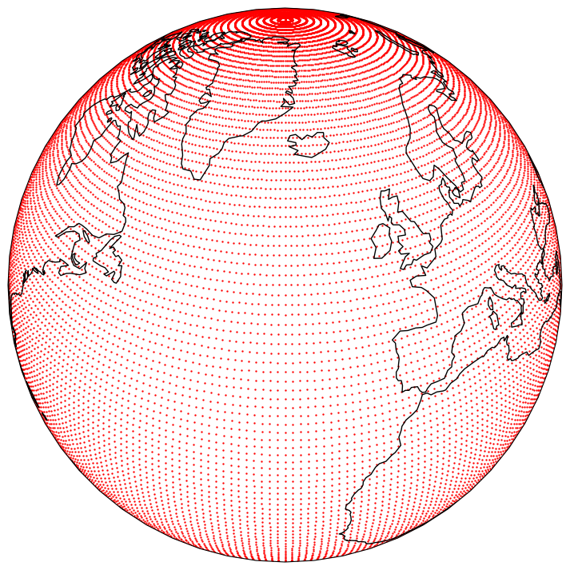
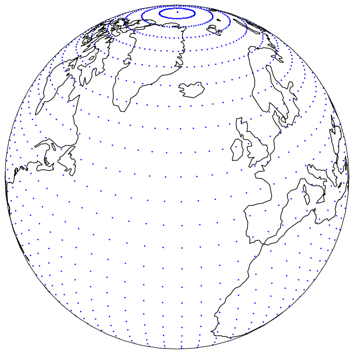
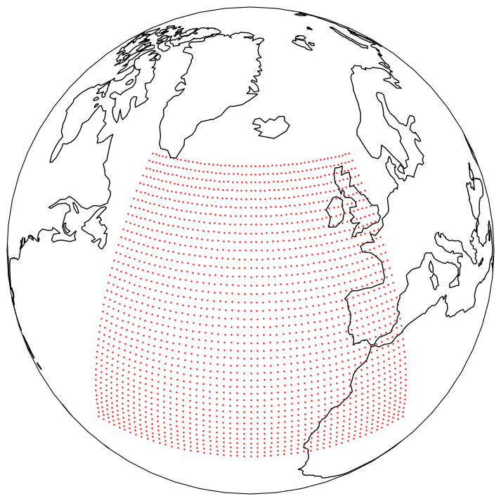

.. _selecting-grids:

#######################
 Selecting grid points
#######################

**********
 thinning
**********

You can thin a dataset by specifying the ``thinning`` parameter in the
``open_dataset`` function. The ``thinning`` parameter depends on the
``method`` selected. The default (and only) method is "every-nth", which
will mask out all but every Nth point, with N specified by the
``thinning`` parameter.

.. code:: python

   ds = open_dataset(dataset, thinning=N, method="every-nth")

Please note that the thinning will apply to all dimensions of the
fields. So for 2D fields, the thinning will apply to both the latitude
and longitude dimensions. For 1D fields, such as reduced Gaussian grids,
the thinning will apply to the only dimension.

The following example shows the effect of thinning a dataset with a 1
degree resolution:

Thinning the dataset with ``thinning=4`` will result in the following
dataset:

******
 area
******

You can crop a dataset to a specific area by specifying the area in the
``open_dataset`` function. The area is specified as a list of four
numbers in the order ``(north, west, south, east)``. For example, to
crop a dataset to the area between 60N and 20N and 50W and 0E, you can
use:

.. code:: python

   ds = open_dataset(dataset, area=(60, -50, 20, 0))

Which will result in the following dataset:

Alternatively, you can specify another dataset as the area. In this
case, the bounding box of the dataset will be used.

.. code:: python

   ds = open_dataset(dataset1, area=dataset2)
