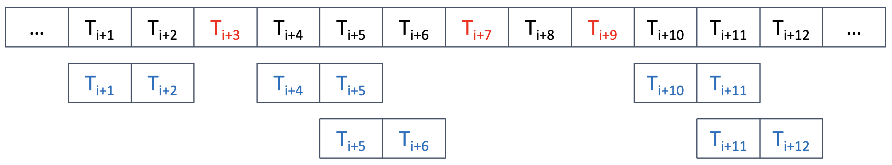

.. _selecting-missing:

########################
 Managing missing dates
########################

*********************************************
 Managing missing dates with anemoi-training
*********************************************

Anemoi-training has internal handling of missing dates and will
calculate the valid date indices used during training using the
``missing`` property. Consequently, when training a model with
anemoi-training, you should `not` specify a method to deal with missing
dates in the dataloader configuration file.

**************************************************
 Filling the missing dates with artificial values
**************************************************

When you have missing dates in a dataset, you can fill them with
artificial values. You can either fill them with values that are the
result of a linear interpolation between the two closest dates:

.. code:: python

   ds = open_dataset(dataset, fill_missing_dates="interpolate")

Or you can copy the value of the closest date:

.. code:: python

   ds = open_dataset(dataset, fill_missing_dates="closest")

If the missing date is exactly in the middle of two dates, the library
will choose the value of the largest date. You can change this behaviour
by setting the ``closest`` parameter to ``'down'`` or ``'up'``
explicitly.

************************************************
 Skipping missing when iterating over a dataset
************************************************

If you iterate over a dataset that has missing dates, the library will
raise a ``MissingDatesError`` exception if you attempt to access a
missing date.

The code below will throw an exception if ``ds[i]`` or ``ds[i+1]`` are
missing dates. Because we iterate over the whole dataset, we are
guaranteed to fail if there are any missing dates.

.. code:: python

   ds = open_dataset(dataset)

   for i in range(len(ds) - 1):
       ds = ds[i + 1] - ds[i]

You can skip missing dates by setting the ``skip_missing_dates`` option
to ``True``. You will also have to provide a hint about how you intend
to iterate over the dataset. The hint is given using the parameter
``expected_access``, which takes a ``slice`` as an argument.

The library will check the slice against the missing dates and ensure
that, when iterating over the dataset with that slice, no missing dates
are accessed.

The algorithm is illustrated in the picture below. The cells represent
the dates in the dataset, and the red cells are the missing dates. Given
``expected_access=slice(0, 2)``, the library will consider each group of
matching dates that are not missing (in blue). The interval between each
date of a group is guaranteed to be constant across all groups.

.. code:: python

   ds = open_dataset(
       dataset,
       skip_missing_dates=True,
       expected_access=slice(0, 2),
   )

   for i in range(len(ds)):
       xi, xi_1 = ds[i]
       dx = xi_1 - xi

The code above will not raise an exception, even if there are missing
dates. The ``slice(0, 2)`` represents the ``i`` and ``i+1`` indices in
the loop (the Python :py:class:`slice` is similar to Python's
:py:class:`range`, as the first bound is included while the last bound
is excluded).

You can also provide a single integer to the ``expected_access``
parameter. The two forms below are identical:

.. code:: python

   expected_access = slice(0, 2)
   expected_access = 2

.. _fill_missing_gaps:

***********************************************
 Concatenating datasets with gaps between them
***********************************************

When you concatenate two or more datasets, the library will check that
the dates are contiguous, i.e. that the last date of a dataset is one
`frequency` before the first date of the next dataset.

If the dates are not contiguous, the library will raise an error. You
can force the concatenation by setting the ``fill_missing_gaps`` option:

.. code:: python

   ds = open_dataset(concat=[dataset1, dataset2, ...], fill_missing_gaps=True)

If there is a gap between the datasets, the library will fill the gap by
creating a virtual dataset with only missing dates and adding it between
the datasets to make the dates contiguous.

***********
 Debugging
***********

You can set missing dates using the ``set_missing_dates`` option. This
option is for debugging purposes only.

.. code:: python

   ds = open_dataset(
       dataset, set_missing_dates=["2010-01-01T12:00:00", "2010-02-01T12:00:00"]
   )
