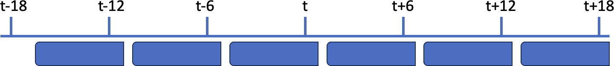
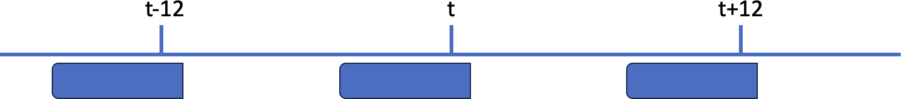
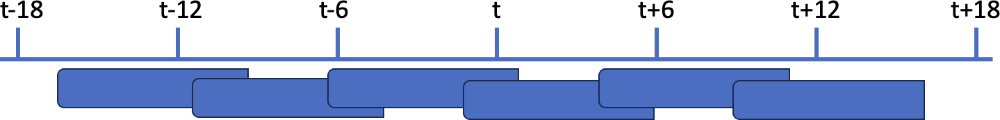

.. _layouts-tabular:

#########
 Tabular
#########

.. note::

   This page describe what is specific to the tabular layout. For more
   general information creating and using datasets, see
   :ref:`using-introduction` and :ref:`building-introduction`
   repectively.

.. _tabular-creating:

**********
 Creating
**********

To create a tabular dataset, the ``layout`` entry in the recipe's
``output`` section must be set to ``tabular``:

.. literalinclude:: code/tabular.yaml

.. _tabular-using:

*******
 Using
*******

To open a tabular dataset, you use the `open_dataset` function with the
`start`, `end`, `window` and `frequency` parameters.

.. literalinclude:: code/tabular1_.py

The default values for ``start`` and ``end`` are the first and last date
of the dataset, respectively. Because these value may fall on full round
hours, it is recommended to set them explicitly.

Unlike for gridded datasets, the ``start``, ``end`` and ``frequency``
parameters can have arbritrary values, and are used to define how
windows are built and how many samples are in the dataset. Note that
``start`` and ``end`` can be outside the range of actual dates in the
datasets. When requesting windows outside the range of actual dates,
empty records will be returned to the user.

The default value for ``window`` is ``(-3h,0]`` and the default value
for ``frequency`` is ``3h``. Windows are **relative** time intervals
that can be open or closed at each end. A round bracket indicates an
open end, while a square bracket indicates a closed end. The default
units are hours.

Windows can be open or closed at each end:

.. code:: python

   "[-3,+3]" # Both ends are included
   "(-1d,0]" # Start is open, end is closed

Samples
=======

The dataset is made of samples, which are built by applying the
``window`` to a list of *reference dates* defined by the ``start``,
``end`` and ``frequency`` parameters. The references dates of the
dataset are defined as all dates between ``start`` and ``end`` with a
step of ``frequency``.

.. code:: python

   result = []
   date = start

   while date <= end:
       result.append(date)
       date += frequency

.. note::

   The **reference dates** are not necessarily the same as the actual
   dates in the dataset. There are used, together with the ``window``
   parameter, used to define the sample returns when iterating the
   dataset. See below for more informataion.

The number of samples in the dataset is then given by the formula:

.. code:: python

   n = (end - start) // frequency + 1

to get the list of dates, you can access the ``dates`` attribute of the
dataset:

.. code:: python

   ds.dates # Returns the list of reference dates defined by start, end and frequency

The length of the dataset is equal to the number of samples:

.. code:: python

   assert len(ds) == n

A sample is a 2D numpay array that is returned when indexing the dataset
with an integer. The first dimension of the array is the number of
observations in the window, and the second dimension is the number of
variables. Each sample is constructed by applying the window to the
corresponding date. For example, if the date is 2020-01-01 00:00:00 and
the window is ``(-3h,0]``, then the sample will contain all observations
between 2019-12-31 21:00:00 and 2020-01-01 00:00:00, including the
latter but not the former.

.. code:: python

   sample = ds[42]

   # A 2D Array is returned, the first dimension is the number of observations
   # in the 43st window (samples are 0-indexed).

   assert len(sample.shape) == 2

   # The second dimension are the variables

   assert sample.shape[1] == len(ds.variables)

the whole dataset can also be iteared over using a for loop:

.. code:: python

   for sample in ds:
       assert len(sample.shape) == 2
       assert sample.shape[1] == len(ds.variables)

is equivalent to:

.. code:: python

   for i in range(len(ds)):
       sample = ds[i]
       assert len(sample.shape) == 2
       assert sample.shape[1] == len(ds.variables)

Dates
=====

The dates of the dataset are defined as all dates between `start` and
`end` with a step of `frequency`. The number of samples in the dataset
is then given by the formula:

.. code:: python

   n = (end - start) // frequency + 1

Windows
=======

Dates
-----

Unlike for fields, where the `start` and `end` must be within the list
of available dates, in the case of observations, `start` and `end` can
be anything, and empty records will be returned to the user when no
observations are available for a given window.

The dates of the dataset are then defined as all dates between `start`
and `end` with a step of `frequency`:

.. code:: python

   result = []
   date = start

   while date <= end:
       result.append(date)
       date += frequency

The pseudo-code above builds the list returned by `ds.dates`.

As a result, the number of samples is:

.. code:: python

   n = (end - start) // frequency + 1

which is also the length of the dataset:

.. code:: python

   len(ds)

Examples
--------

.. code:: python

   ds = open_dataset(
       path,
       start=1979,
       end=2020,
       window="(-5h,+1h]",
       frequency="6h")

Some text

.. code:: python

   ds = open_dataset(
       path,
       start=1979,
       end=2020,
       window="(-5h,+1h]",
       frequency="6h")

Some text

.. code:: python

   ds = open_dataset(
       path,
       start=1979,
       end=2020,
       window="(-5h,+1h]",
       frequency="6h")

Some text

.. code:: python

   ds = open_dataset(
       path,
       start=1979,
       end=2020,
       window="(-5h,+1h]",
       frequency="6h")

Some text

.. image:: ../_static/window-4.png
   :width: 75%
   :align: center

Some text

Auxiliary information such as latitudes, longitudes, dates, etc. are
also returned with each sample. To sort --------

Tabular data are typically observations. Each observation has its own
time and location. All observation shoul have the same set of variables,
which can be NaNs for some observations.

.. code:: python

   sample = ds[42]

   # A 2D Array is returned, the first dimension is the number of observations in the 43st window.
   assert len(sample.shape) == 2

   # The second dimension are the variables
   assert sample.shape[1] == len(ds.variables)

   # Same for statistics

   assert len(ds.statistics['mean']) == len(ds.variables)

Auxiliary information can be accessed as:

.. code:: python

   sample = ds[42]

   number_of_observations_in_window = sample.shape[0]

    # Returns the corresponding latitudes

   sample.latitudes

   assert len(sample.latitudes) == number_of_observations_in_window

   # Returns the corresponding longitudes

   sample.longitudes

   assert len(sample.longitudes) == number_of_observations_in_window

   x.dates # Returns the corresponding row dates

   # Returns the corresponding dates

   sample.dates

   assert len(sample.dates) == number_of_observations_in_window

   # Return the reference date of the window

   sample.reference_date

   assert sample.reference_date == ds.start_date + 42 * ds.frequency

   # Return the timedeltas in seconds relative to the reference_date

   sample.timedeltas

   assert len(sample.timedeltas) == number_of_observations_in_window
