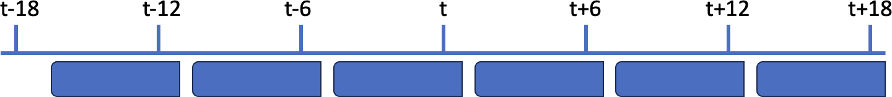
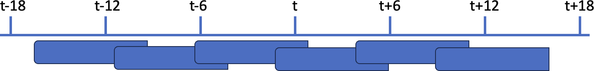

.. _layouts-tabular:

#########
 Tabular
#########

.. note::

   This page describe what is specific to the tabular layout. For more
   general information creating and using datasets, see
   :ref:`using-introduction` and :ref:`building-introduction`
   respectively.

.. _tabular-creating:

**********
 Creating
**********

To create a tabular dataset, the ``layout`` entry in the recipe's
``output`` section must be set to ``tabular``:

.. literalinclude:: code/tabular.yaml

.. _tabular-using:

*******
 Using
*******

To open a tabular dataset, you use the `open_dataset` function with the
`start`, `end`, `window` and `frequency` parameters.

.. literalinclude:: code/tabular1_.py

The default values for ``start`` and ``end`` are the first and last date
of the dataset, respectively. Because these value may fall on full round
hours, it is recommended to set them explicitly.

Unlike for gridded datasets, the ``start``, ``end`` and ``frequency``
parameters can have arbitrary values, and are used to define how windows
are built and how many samples are in the dataset. Note that ``start``
and ``end`` can be outside the range of actual dates in the datasets.
When requesting windows outside the range of actual dates, empty records
will be returned to the user.

The default value for ``window`` is ``(-3h,0]`` and the default value
for ``frequency`` is ``3h``. Windows are **relative** time intervals
that can be open or closed at each end. A round bracket indicates an
open end, while a square bracket indicates a closed end. The default
units are hours.

Windows can be open or closed at each end:

.. code:: python

   "[-3,+3]" # Both ends are included
   "(-1d,0]" # Start is open, end is closed

Data samples
============

The dataset is made of samples, which are built by applying the
``window`` to a list of *reference dates* defined by the ``start``,
``end`` and ``frequency`` parameters.

Reference dates
---------------

The references dates of the dataset are defined as all dates between
``start`` and ``end`` with a step of ``frequency``.

.. code:: python

   result = []
   date = start

   while date <= end:
       result.append(date)
       date += frequency

.. note::

   The **reference dates** are not necessarily the same as the actual
   dates in the dataset. They are used, together with the ``window``
   parameter, to define the samples returned when iterating the dataset.
   See below for more information. Nevertheless, in order to ensure
   compatibility with gridded datasets, the reference dates are
   available as the ``dates`` attribute of the dataset.

   It is not currently possible to combine tabular and gridded datasets within a single call to ``open_dataset``,
   but when this will be implemented, ``ds.dates``, ``ds.frequency``,
   ``len(ds)``, etc. will all be compatible and comparable between the
   two layouts.

   .. code:: python

      ds.dates # Returns the list of reference dates defined by start, end and frequency

The number of samples in the dataset is then given by the formula:

.. code:: python

   number_of_samples = (end - start) // frequency + 1

to get the list of dates, you can access the ``dates`` attribute of the
dataset:

.. code:: python

   ds.dates # Returns the list of reference dates defined by start, end and frequency

The length of the dataset is equal to the number of samples:

.. code:: python

   assert len(ds) == number_of_samples

Single sample
-------------

A sample is a 2D numpy array that is returned when indexing the dataset
with an integer. The first dimension of the array is the number of
observations in the window, and the second dimension is the number of
variables. Each sample is constructed by applying the window to the
corresponding date. For example, if the date is 2020-01-01 00:00:00 and
the window is ``(-3h,0]``, then the sample will contain all observations
between 2019-12-31 21:00:00 and 2020-01-01 00:00:00, including the
latter but not the former.

.. code:: python

   sample = ds[42]

   # A 2D array is returned, the first dimension is the number of observations
   # in the 43rd window (samples are 0-indexed).

   assert len(sample.shape) == 2

   # The second dimension is the variables

   assert sample.shape[1] == len(ds.variables)

The whole dataset can also be iterated over using a for loop:

.. code:: python

   for sample in ds:
       assert len(sample.shape) == 2
       assert sample.shape[1] == len(ds.variables)

is equivalent to:

.. code:: python

   for i in range(len(ds)):
       sample = ds[i]
       assert len(sample.shape) == 2
       assert sample.shape[1] == len(ds.variables)

.. _tabular-auxiliary-information:

Auxiliary information
^^^^^^^^^^^^^^^^^^^^^

Becuse tabular data is unstructured, information such as the latidudes,
longitudes and dates if the actual data cannot be provided at the
dataset level. Instead, it is provided at the sample level. When you
access a sample, you can also access the corresponding latitudes,
longitudes, dates, etc. This information is returned as attributes of
the sample:

Auxiliary information can be accessed as:

.. code:: python

   sample = ds[42]

   number_of_observations_in_window = sample.shape[0]

    # Returns the corresponding latitudes

   sample.latitudes

   assert len(sample.latitudes) == number_of_observations_in_window

   # Returns the corresponding longitudes

   sample.longitudes

   assert len(sample.longitudes) == number_of_observations_in_window

   sample.dates # Returns the corresponding row dates

   # Returns the corresponding dates

   sample.dates

   assert len(sample.dates) == number_of_observations_in_window

   # Return the reference date of the window

   sample.reference_date

   assert sample.reference_date == ds.start_date + 42 * ds.frequency

   # Return the timedeltas in seconds relative to the reference_date

   sample.timedeltas

   assert len(sample.timedeltas) == number_of_observations_in_window

Slices
------

When slicing the dataset, the same rules apply as for indexing with an
integer, but you can recover the samples using the ``boundaries``
attribute of the resulting array . The ``boudaries`` attribute is a list
of ``slice`` objects that can be used to access the samples in the
result. You also can retrieve the reference dates with the
``reference_dates`` attribute of the result.

.. code:: python

   samples = ds[10:30]

   assert len(samples.boundaries) == 20
   assert len(samples.reference_dates) == 20

   i = 10
   for b in samples.boundaries:
         sample = samples[b]
         assert np.array_equal(sample, ds[i])
         i += 1

The ``latitudes``, ``longitudes``, ``dates``, ``timedeltas``, etc.
attributes of the resulting array are the concatenation of the
corresponding attributes of the samples.

.. code:: python

   assert np.array_equal(samples.latitudes, np.concatenate([ds[i].latitudes for i in range(10,30)]))

   assert np.array_equal(samples.longitudes, np.concatenate([ds[i].longitudes for i in range(10,30)]))

   assert np.array_equal(samples.dates, np.concatenate([ds[i].dates for i in range(10,30)]))

.. warning::

   The two codes below are not equivalent:

   .. code:: python

      samples = ds[10:30]
      boundaries = samples.boundaries

      latitudes = samples.latitudes[boundaries[1]]

   and:

   .. code:: python

      samples = ds[10:30]
      boundaries = samples.boundaries

      latitudes = samples[boundaries[1]].latitudes

   Only the first construct will work.

Examples
--------

The following examples show various ways to define the window and the
frequency parameters when opening a tabular dataset.

First example, the window width (6h) matches the frequency (6h), so the
whole dataset is covered:

.. code:: python

   ds = open_dataset(
       path,
       start=1979,
       end=2020,
       window="(-6h,0]",
       frequency="6h")

The schema below illustrates the window and frequency parameters in this
case:

Second example, the window width (6h) is narrower than the frequency
(12h), so there are gaps between the windows:

.. code:: python

   ds = open_dataset(
       path,
       start=1979,
       end=2020,
       window="(-5h,+1h]",
       frequency="12h")

As illustrated in the schema below, there are gaps between the windows:

In the third example, the window width (8h) is wider than the frequency
(6h), so there are overlaps between the windows:

.. code:: python

   ds = open_dataset(
       path,
       start=1979,
       end=2020,
       window="(-5h,+3h]",
       frequency="6h")

As illustrated in the schema below, there are overlaps between the
windows:

.. _tabular-sharding:

*********
 Sharding
*********

.. note::

   Sharding is currently only available for the tabular layout.

For distributed loading, a tabular dataset can be split into ``N``
**shards**. Each shard returns the *same* windows (same ``dates``,
``frequency``, ``variables`` and ``len``), but every window yields only
a contiguous ``1/N`` slice of its rows. The shards are non-overlapping
and together cover every row exactly once, so no observation is
duplicated or lost.

To obtain the shards, pass the ``sharding`` parameter:

.. code:: python

   shards = open_dataset(path, sharding=8)

   assert len(shards) == 8

   shard = shards[3]  # the 4th shard, itself a dataset

   sample = shard[42]  # only this shard's rows of window 42

The object returned by ``sharding`` behaves like a list of the shard
datasets (you can index it, iterate it and take its length), and each
shard accepts all the usual tabular methods and attributes.

A single process can request just one shard with the ``shard``
parameter (``shard`` requires ``sharding``):

.. code:: python

   shard = open_dataset(path, sharding=8, shard=3)

   assert shard.shard_index == 3
   assert shard.num_shards == 8

Reassembling the shards
=======================

The library does **not** reassemble the shards for you; it provides the
sizes and offsets needed to do so. Because the split is deterministic,
every shard can compute the full layout on its own, without
communicating with the others.

The following sizing information is available on each shard (and on the
collection returned by ``sharding``):

.. code:: python

   shards.unsharded_sizes  # rows per window in the unsharded dataset
   shards.shard_sizes      # rows per shard per window, shape (N, n_windows)
   shards.total_size       # total number of rows across all windows

   # The columns of shard_sizes sum to the unsharded sizes:
   assert np.array_equal(shards.shard_sizes.sum(axis=0), shards.unsharded_sizes)

When a shard is indexed, the resulting array carries two boundary
attributes. As for any tabular slice, ``boundaries`` gives the per-window
slices **within the shard's own array**. In addition,
``unsharded_boundaries`` gives the per-window slices into the **full,
unsharded** array, i.e. where this shard's rows belong once all shards
are put back together.

.. code:: python

   # In each worker, holding a single shard:
   full = np.zeros((shards.unsharded_sizes[a:b].sum(), len(shard.variables)), dtype=...)

   arr = shard[a:b]
   data = np.asarray(arr)
   for src, dst in zip(arr.boundaries, arr.unsharded_boundaries):
       full[dst] = data[src]

For an unsharded dataset, ``unsharded_boundaries`` is equal to
``boundaries``.

When the shards are created in a single process with ``sharding=N``,
each shard also exposes its siblings through the ``other_shards``
attribute. In ``shard=i`` mode the siblings live in other processes, so
``other_shards`` is ``None`` (but ``shard_sizes`` and ``total_size``
remain available).

Sharding composes with the other tabular parameters (``start``, ``end``,
``window``, ``frequency``, ``select``, ...): they are applied first, and
each window of the resulting dataset is then sharded. Sharding cannot be
applied twice (you cannot shard an already-sharded dataset).
