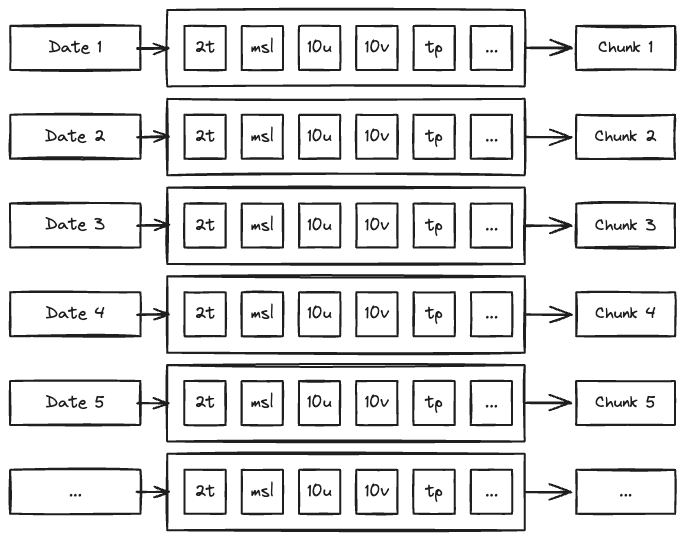

.. _overview:

##########
 Overview
##########

************
 Dimensions
************

Training datasets are large array-like objects encoded in Zarr_ format.

The array has the following dimensions:

.. figure:: schemas/overview.png
   :alt: Data layout
   :align: center

The first dimension is the time dimension, the second dimension are the
variables (e.g. temperature, pressure, etc), the third dimension is the
ensemble, and fourth dimension are the grid points values.

**********
 Chunking
**********

"Chunks" are the basic unit of data storage in Zarr_. This means that it
is the granularity at which data is read from disk.

By default, the array is chunked along the time dimension so the whole
state of the atmosphere at a given time is loaded in one go:

This structure provides an efficient way to build the training dataset,
as input and output of the model are simply consecutive slices of the
array.

.. literalinclude:: overview_.py
   :language: python

.. _zarr: https://zarr.readthedocs.io/
