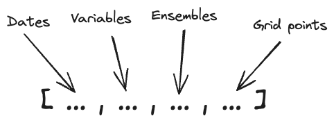
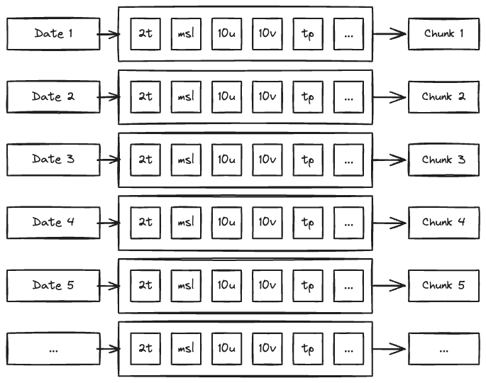

.. _overview:

##########
 Overview
##########

**What are anemoi datasets?** Anemoi datasets are objects designed for
training data-driven weather forecasting models efficiently within the
anemoi framework. By focusing on a specific use-case, anemoi-datasets
can make assumptions about the dominant access pattern of the data and
can be optimised to minimise the number of I/O operations – improving
data throughput for this task. Under the hood, anemoi datasets are
implemented as a thin wrapper around a Zarr store. However, we recommend
that users do not rely on this feature as the underlying storage format
may need to change or be expanded in the future.

In practice, anemoi datasets are copies of existing datasets
(reanalyses, forecasts, climate simulations, etc.) that have been
processed to be used as input for machine learning models based on a
recipe. For example, let us assume we want to train a data-driven model
with a resolution of 1° spatial resolution and 6-hour timesteps based on
a subset of variables from the ERA5 reanalysis. To accommodate this, we
will create an anemoi-dataset by interpolating the chosen ERA5 variables
to the desired resolution (1°) and at the right frequency (6h or
higher). In addition to serving the main purpose of a training dataset,
these objects can also be used to provide initial conditions to machine
learning models.

**What are anemoi datasets not?** While anemoi datasets can be easily
inspected and accessed, these are not designed for general-purpose data
analytics. If there is a requirement to perform general-purpose
computations, e.g., groupby operations, aggregations, etc., then
operating with packages such as Xarray_ on the original dataset would be
better.

**What can you learn from this documentation?** This documentation
provides an overview of an anemoi dataset. You will learn to build
anemoi datasets from different sources and to inspect the datasets you
created for further use within other anemoi packages.

********************************
 Structure of an anemoi dataset
********************************

Training datasets are large array-like objects encoded in Zarr_ format.

The array has the following dimensions:

The first dimension is the time dimension, the second dimension is the
variables (e.g., temperature, pressure, etc.), the third dimension is
the ensemble, and the fourth dimension is the grid points values.

*******************************
 Chunking of an anemoi dataset
*******************************

"Chunks" are the basic unit of data storage in Zarr_. This means that it
is the granularity at which data is read from disk.

By default, the array is chunked along the time dimension so the whole
state of the atmosphere at a given time is loaded in one go:

This structure provides an efficient way to build the training dataset,
as input and output of the model are simply consecutive slices of the
array.

.. code:: python

   x, y = ds[n : n + 1]
   y_hat = model.predict(x)
   loss = model.loss(y, y_hat)

This is illustrated in the following video:

.. raw:: html

   <video width="100%" controls>
     <source src="https://anemoi.ecmwf.int/static/images/datasets.mp4" type="video/mp4">
   </video>

.. _xarray: https://docs.xarray.dev/en/stable/index.html

.. _zarr: https://zarr.readthedocs.io/
