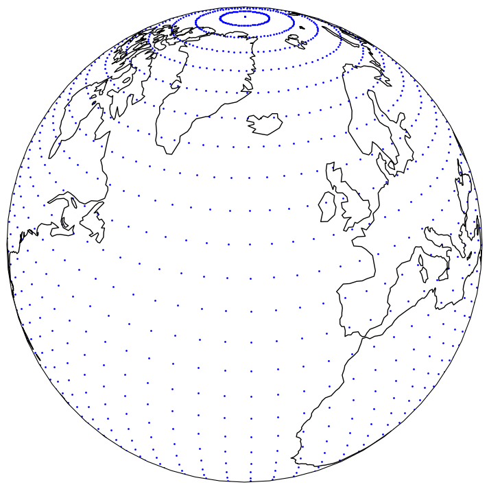
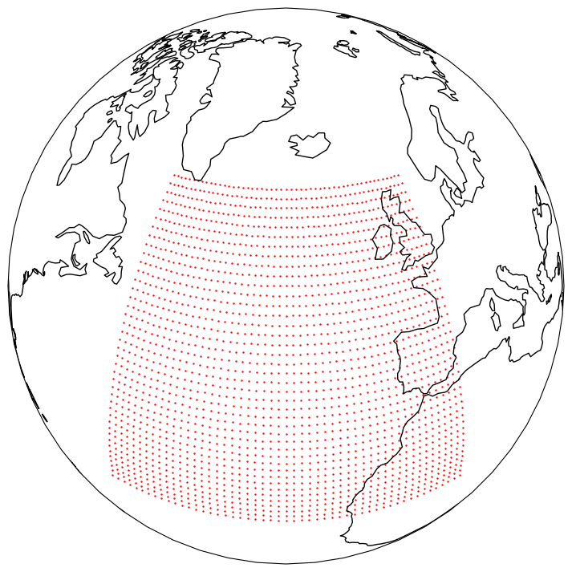

.. _using-grids:

#######################
 Selecting grid points
#######################

**********
 thinning
**********

You can thin a dataset by specifying the ``thinning`` parameter in the
``open_dataset`` function. The ``thinning`` parameter depends on the
``method`` selected. The default (and only) method is "every-nth", which
will mask out all but every Nth point, with N specified by the
``thinning`` parameter.

.. literalinclude:: code/grids_thinning_.py

Please note that the thinning will apply to all dimensions of the
fields. So for 2D fields, the thinning will apply to both the latitude
and longitude dimensions. For 1D fields, such as reduced Gaussian grids,
the thinning will apply to the only dimension.

The following example shows the effect of thinning a dataset with a 1
degree resolution:

.. image:: ../_static/thinning-before.png
   :width: 75%
   :align: center

Thinning the dataset with ``thinning=4`` will result in the following
dataset:

*********
 masking
*********

You can apply an arbitrary spatial mask to a dataset by specifying the
``mask`` parameter in the ``open_dataset`` function. The mask must be a
NumPy .npy file containing a boolean array, where True indicates points
to be kept and False indicates points to be removed.

.. literalinclude:: code/grids_masking_.py

The mask array must have the same total number of grid points and
dimension as the dataset. Please note that this masking will not be
automatically applied to the input data provided during inference.
Users must ensure they are applying the mask explicitly, for instance
via the use of pre-processors.

******
 area
******

You can crop a dataset to a specific area by specifying the area in the
``open_dataset`` function. The area is specified as a list of four
numbers in the order ``(north, west, south, east)``. For example, to
crop a dataset to the area between 60N and 20N and 50W and 0E, you can
use:

.. literalinclude:: code/grids_area_.py

Which will result in the following dataset:

Alternatively, you can specify another dataset as the area. In this
case, the bounding box of the dataset will be used.

.. literalinclude:: code/grids_area_dataset_.py

***********
 trim_edge
***********

You can remove the edges of a limited area domain by specifying
``trim_edge`` parameter in the ``open_dataset`` function. This can
either be an integer, representing the number of gridpoints to remove
along each edge, or a tuple of four integers in the order ``(lower_dim0,
upper_dim0, lower_dim1, upper_dim1)``.

That is, the following

.. literalinclude:: code/grids_trim_edge_.py

will remove the first 3 and last 10 rows of the domain, and the first 4
and last 2 columns of the domain. If the first dimension of the grid is
the y-dimension (i.e north/south), then 3 grid points in the south, 10
in the north, 4 in the west and 2 in the east will be removed.

Note that if ``thinning`` is also specified, ``trim_edge`` is applied
first.
