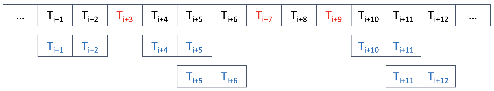

.. _selecting-missing:

########################
 Managing missing dates
########################

************************************************
 Skipping missing when iterating over a dataset
************************************************

If you iterate over a dataset that has missing dates, the library will
raise a ``MissingDatesError`` exception if you attempt to access a
missing date.

This code below will throw an exception if ``ds[i]`` or ``ds[i+1]`` are
missing dates. Because we iterate over the whole dataset, we are
guaranteed to fail if there are any missing dates.

.. literalinclude:: code/iterating_missing_dates1_.py

You can skip missing dates by setting the ``skip_missing_dates`` option
to ``True``. You will have to also provide a hint about how you intent
to iterate over the dataset. The hint is given using the parameter
``expected_access`` which takes a ``slice`` as argument.

The library will check the slice against the missing dates and insure
that, when iterating over the dataset with that slice, no missing dates
are accessed.

The algorithm is illustrated in the picture below. The cells represents
the dates in the dataset, and the red cells are the missing dates. Given
``expected_access=slice(0, 2)``, the library will consider each group of
matching dates that are not missing (in blue). The interval between each
dates of a group is guaranteed to be constant across all groups.



.. literalinclude:: code/iterating_missing_dates2_.py

The code above will not raise an exception, even if there are missing
dates. The ``slice(0, 2)`` represents the ``i`` and ``i+1`` indices in
the loop (the Python :py:class:`slice` is similar to Python's
:py:class:`range`, as the first bound in included while the last bound
is excluded).

You can also provide a single integer to the ```expected_access``
parameter. The two forms below are identical:

.. literalinclude:: code/iterating_missing_dates3_.py

.. _fill_missing_gaps:

***********************************************
 Concatenating datasets with gaps between them
***********************************************

When you concatenate two or more datasets, the library will check that
the dates are contiguous, i.e. that the last date of a dataset is one
`frequency` before the first date of the next dataset.

If the dates are not contiguous, the library will raise an error. You
can force the concatenation by setting the ``fill_missing_gaps`` option:

.. literalinclude:: code/fill_missing_gaps_.py

If there is a gap between the datasets, the library will fill the gap by
creating a virtual dataset with only missing dates, and add it between
the datasets to make the dates contiguous.

***********
 Debugging
***********

You can set missing dates using the ``missing_dates`` option. This
option is for debugging purposes only.

.. literalinclude:: code/missing_dates_.py
